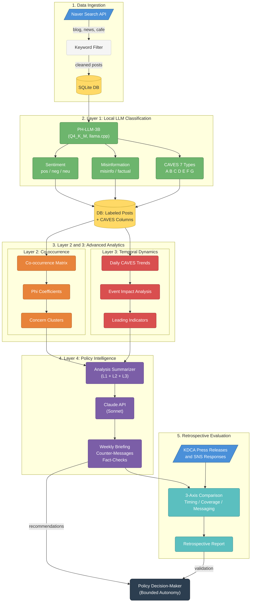

# Infovail-IQ

### ⚠️ Disclaimer

*This is a personal research project conducted by the author. The views, thoughts, and opinions expressed in this project belong solely to the author and do not necessarily reflect the official policy or position of the Korea Disease Control and Prevention Agency (KDCA) or any other agency/organization.*

> **Multi-Layered AI Infoveillance for Public Health Policy**
>
> *"Beyond Sentiment Analysis: Decoding the Architecture of Public Distrust through CAVES-based Intelligence."*

Infovail-IQ automates the **WHO CAVES framework** for vaccine hesitancy using compact LLMs, transforming social media data into actionable policy intelligence. It offers a cost-effective and scalable solution for real-time infodemic management, specifically tailored for both advanced health agencies and Low- and Middle-Income Countries (LMICs).

---

## Core Philosophy: Bounded Autonomy

Infovail-IQ operates on the principle of **Bounded Autonomy**. It does not aim to replace human decision-makers but rather to provide a "structured guide" by decomposing complex public sentiments into manageable, evidence-based policy signals.

---

## Architecture

> 📐 [Edit this diagram on Mermaid Chart](https://mermaid.ai/live/edit?utm_source=mermaid_mcp_server&utm_medium=remote_server&utm_campaign=claude#pako:eNqNVmtP4zgU_StWkFYzmhZInEDJh5XyXBDtiKFo9wMZjUzitBaJXdkJ0N3Z_77XcVrSFpgNUsDxPcf3nvsw_1i5KKjlW2UlnvMlkQ26CzOO4MkrolRMS6REK3OKSlZV_pEbXJzGFyPVSPFI_SMn8tJJMMpFJaR_VJblSL74kz2ClRQ5VapnSD39s2WIumfDgDHWDO4eQ_GwAafxxdnZFhymgY1PfwGuyJpKuyc4i0PvLN4S4Pg8wPGe_28SOD1BMplgHLx6gL3UTv4PAe4J4gs3ddMtQXCKT19D-IjA7QnOQy8JzrcEHgQwcX5BQJ9I1cO9MEzD1_NxMAkOMrgPX7Y14T3eiXDinW7xduB4TnpYAYZBtQ8LSVZLNLfvM8s-RjFpCLriC6oaJnhmfTd2-gns-5PM-kqeqERzSmS-RMHNVWadfPd93xThwNgBvmu6fhayQCmrGiqBDAz7YhtY4vtPmTX_NmUNRXGYWZ-1WfFgLCgvNr4GNhqPf_-ZWQ-VWIwQp89qhHJS0sz6Cef1m3lFCacFWgnVqG4HHwarnXOO0VSnDdk-mooc9J9OZyjSkrKS5eQg_lBLdHM5BrMxDrOMf_rm_rj-MRuhqiI1Oc5Xq88mRlPRA6Q-b055w2p4ARKcQycQwaJ7t--gMKBmTDFeClkbfzJemw8ALEnetKR6B-wCOAr-TOboHN2tV1QBNkAhilCMEpSiPw5xQ62xlhNCNsvQNksH_QZu6Ze7sRx-64zi0DE78IfObByCvuSBVpCUmy4pGf-CjGuRqNqaq0HO9zOlNcCbTDmI8AJhHwXFE-E5EAacVOuG5WonU1v4VAvfY304bSzyvJWSAnYHoJ9Ip3fHBM1II9nLQChnD6Lpb5YMmGkJNcMgu-oDc9ydAMySQ6G1CpriHfMuFYfh4G04IMIdrVdCQt3Ga07qfQ26DOiQYsKqda_3HcRVDI_EewAdUPIEYaCregX1ZQRW7CNM5xQlBeMLmByFbh0h3wFs4xrUGtRJVziRKbKoX-Hd3djsxv3qjabWFe9uSsX1odgqlq_BpYZWFVscJD3R6mziQ_O2rolkf8Ocgs6e2ugLVI9-4WFTuwO41grGRVvQbg4Cai44p8179lqnvyh9hGyEktES9AJQJFpwUI5nMBTJomvTFIQfR0uaP6pDqoFwkWnSpG_SeHeZGMESI1jyhmAeOOQdo1sKV4Va0bxhTxQlcBO1h8Mv7Yb_dRwF6EbqfxZuoaGJ6vzVTTn_OodPaiW4_vb2nZBqxfA4eAG5IwH1JZnqZtodq3XxnMBXuFxABfjT6KE16iTQF-SASWu56_cthWZo9o0HaiVGnrTvstTul-bXVp5L3dKmcmKaw7AVfDwjj6YsQkhWocdO2wgu6nWf6u763T0HbiJJc1HDwC86Nbu76LI_e2MCfrKiFxt2rX__A6JR9vk) | Source: [`docs/architecture.mermaid`](docs/architecture.mermaid)

* **Layer 1: Aggregation** (The "What")
  — Sentiment distribution, CAVES type ratios, and misinformation detection using PH-LLM-3B.

* **Layer 2: Co-occurrence Analysis** (The "Structure")
  — Analyzes how concerns cluster together (e.g., Government Distrust + Side Effects) using Phi coefficients to reveal the underlying architecture of distrust.

* **Layer 3: Temporal Dynamics** (The "When")
  — Tracks shifts in public opinion before and after official responses to evaluate intervention efficacy and identify leading indicators of emerging concerns.

* **Layer 4: Policy Intelligence** (The "Action")
  — Generates weekly policy briefings via Claude API, including behavioral directives and counter-messaging strategies based on integrated insights from Layers 1–3.

---

## Current PoC Scenario

**2026 COVID-19 Vaccine Contamination Audit** (South Korea)
— Board of Audit report on 1,285 foreign substance cases in vaccines, triggering a complex public trust crisis.

---

## Roadmap

- [ ] **PoC1** — Local model validation & prompt engineering
- [ ] **PoC2** — Policy intelligence dashboard & 4-week operational trial
- [ ] **Retrospective evaluation** — System recommendations vs. actual KDCA responses
- [ ] **Publication** — Target: *JMIR Infodemiology* / *IJMI*

---

## Author

**Suah Cheon, MD** — Deputy Director at KDCA

Public Health Practitioner & Researcher
Focus: Pharmacovigilance, AI-driven Public Health, System Architecture

## License

[MIT](LICENSE)
