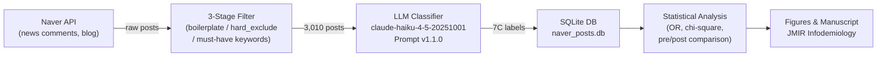

# Infovail-IQ

### ⚠️ Disclaimer

*This is a personal research project conducted by the author. The views, thoughts, and opinions expressed in this project belong solely to the author and do not necessarily reflect the official policy or position of the Korea Disease Control and Prevention Agency (KDCA) or any other agency/organization.*

> **Multi-Layered AI Infoveillance for Public Health Policy**
>
> *"Beyond Sentiment Analysis: Decoding the Architecture of Public Distrust through 7C-based Intelligence."*

Infovail-IQ automates the **7C framework** (Geiger et al., 2021) for vaccine hesitancy classification using LLMs, transforming social media data into actionable policy intelligence. It offers a cost-effective and scalable solution for real-time infodemic management.

---

## Core Philosophy: Bounded Autonomy

Infovail-IQ operates on the principle of **Bounded Autonomy**. It does not aim to replace human decision-makers but rather to provide a structured guide by decomposing complex public sentiments into manageable, evidence-based policy signals.

---

## PoC1 — Completed (March 2026)

**Research question:** How do 7C-type distributions of vaccine hesitancy discourse change before and after institutional disclosure events, across Naver social media channels?

### Dataset

| Item | Value |
|---|---|
| Platform | Naver (news comments, blog) |
| Collection period | 2026-02-07 – 2026-03-21 (6 weeks) |
| Raw posts collected | 8,694 |
| Final analyzed corpus | **3,010 posts** (after 3-stage filtering) |
| Keywords | 10 vaccine-related terms |

### Trigger Events

| Event | Date | Description |
|---|---|---|
| E1 | 2026-02-23 | Board of Audit and Inspection (BAI) report: 1,285 unreported foreign substance cases in COVID-19 vaccines |
| E2 | 2026-03-02 | SBS broadcast: court-recognized causal link between COVID-19 vaccination and myocardial infarction death |

### Classification Pipeline

- **Framework:** 7C model (Geiger et al., 2021) — Confidence, Complacency, Constraints, Calculation, Collective responsibility, Compliance, Conspiracy
- **Empirical bridge:** CAVES dataset (Poddar et al., 2022, SIGIR) → 7C mapping
- **Model:** `claude-haiku-4-5-20251001` (snapshot fixed for reproducibility)
- **Prompt version:** v1.1.0 (see [`PROMPT_REGISTRY.md`](PROMPT_REGISTRY.md))
- **CAVES benchmark:** macro F1 = 0.585
- **Korean gold standard:** macro F1 = 0.548, κ = 0.330 (n=41, dual-author)

### Key Findings

- Post-E1 surge in C1 (Confidence) and C7 (Conspiracy) across news comments
- C6 (Compliance) as pre-existing baseline; E2 converted diffuse conspiratorial framing into targeted institutional distrust ("discourse specificization")
- Only ~5% overlap between E1 and E2 discourse clusters → issue-specific independent activation pathways
- Naver Blog: global conspiracy content circulation medium; News comments: event-reactive institutional distrust medium

### Output

- Manuscript submitted to *JMIR Infodemiology* (pending IRB exemption confirmation)
- Abstract submitted to ISoP Global Meeting 2026

→ See [`docs/POC_SCENARIO.md`](docs/POC_SCENARIO.md) for full scenario context.

---

## Repository Structure

```
infovail-iq/
├── pipeline/
│   └── ingestion/          # Naver API client, DB, preprocessor
├── scripts/                # Collection, classification, analysis scripts
├── data/
│   ├── caves/processed/    # CAVES benchmark dataset (train/val/test)
│   ├── exports/labeled/    # LLM classification outputs (JSONL)
│   └── processed/          # SQLite DB (naver_posts.db)
├── outputs/
│   └── figures/            # Publication-ready figures (300 dpi PNG)
├── docs/                   # Manuscript drafts, codebooks, IRB documents
├── PROMPT_REGISTRY.md      # Prompt version history
├── HANDOFF_SESSION_END.md  # Session continuity document
└── README.md
```

---

## Architecture


```mermaid
flowchart LR
    A["Naver API\n(news comments, blog)"] -->|"raw posts"| B["3-Stage Filter\n(boilerplate / hard_exclude\n/ must-have keywords)"]
    B -->|"3,010 posts"| C["LLM Classifier\nclaude-haiku-4-5-20251001\nPrompt v1.1.0"]
    C -->|"7C labels"| D["SQLite DB\nnaver_posts.db"]
    D --> E["Statistical Analysis\n(OR, chi-square,\npre/post comparison)"]
    E --> F["Figures & Manuscript\nJMIR Infodemiology"]
```

---

## Roadmap

- [x] **PoC1** — 7C LLM classification pipeline + Korean social media analysis (Mar 2026)
- [ ] **PoC2** — Broader keyword coverage (pro-vaccine, neutral) + multi-platform expansion
- [ ] **Policy intelligence dashboard** — Real-time 4-week operational trial
- [ ] **Retrospective evaluation** — System recommendations vs. actual KDCA responses

---

## Tech Stack

- Python 3.11+, [uv](https://github.com/astral-sh/uv)
- SQLite (data storage)
- Anthropic Batch API (`claude-haiku-4-5-20251001`)
- Naver Search API (data collection)
- matplotlib, Paul Tol "Muted" palette (figures)

---

## Key References

- Geiger, M. et al. (2021). The 7C model of vaccination readiness. *EJPA*.
- Poddar, S. et al. (2022). CAVES: An annotated corpus for vaccine stance detection. *SIGIR*.
- Betsch, C. et al. (2018). Beyond confidence: Development of a measure assessing the 5C psychological antecedents of vaccination. *PLoS ONE*.
- Chu, J. et al. (2025). Korea vaccine injury compensation. *Vaccine*. PMID 40037238.

---

## Author

**Suah Cheon, MD, M.M.Sc.** — Deputy Director, KDCA
ORCID: [0009-0004-5961-2850](https://orcid.org/0009-0004-5961-2850)

**Euncheol Son, MD, PhD** — University of Ulsan College of Medicine (co-author, PoC1)
ORCID: [0000-0002-5288-1490](https://orcid.org/0000-0002-5288-1490)

---

## License

[MIT](LICENSE)
